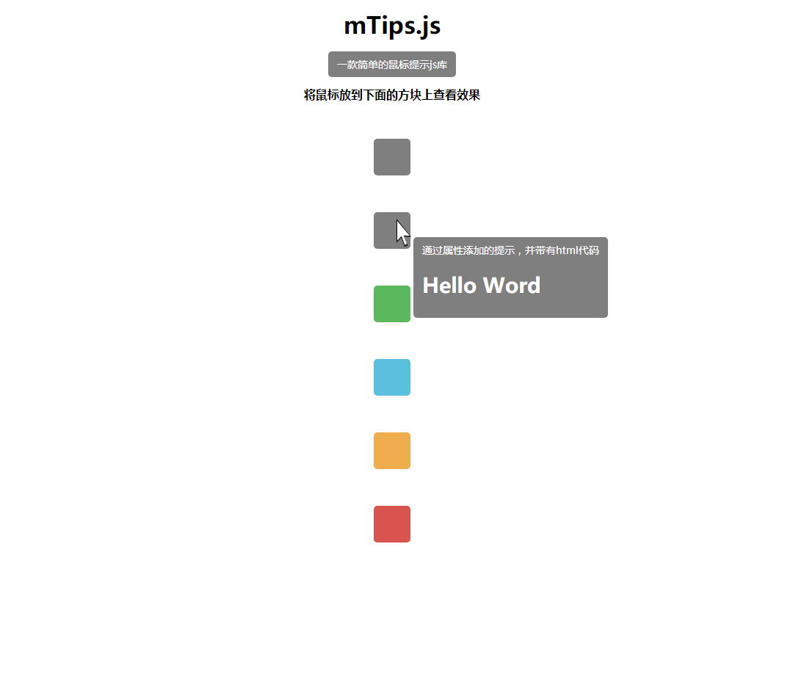

# 预览

地址：https://alny-ac.github.io/mTips/index.html


# 准备

下载：https://codeload.github.com/ALNY-AC/mTips/zip/master

# 安装

将下载后的`mTips.js`文件放到项目下，在需要的页面中导入。

>  此项目依赖JQuery.js，在使用前需要引入JQuery。


# 简单使用

第一步：在页面导入`mTips.js`

第二步：给标签添加属性`data-mtpis`

````html
<div data-mtpis='写入提示文本'></div>
````

完成，快去看看吧！可以插入html代码。

> 不导入css样式文件一样可以显示，如果想要更多的样式，就需要导入css文件，这一点在下文可以看到。

# 注意

> 提示功能可能无法给动态生成的页面元素添加提示，但是这种情况已经修复。


# 使用

## 通过属性开启

````html
<div data-mtpis='提示文本'></div>
````

给任意标签添加`data-mtpis`属性即可让此标签拥有鼠标工具提示功能。

如果想修改提示的文本，只需要修改`data-mtpis`属性的值即可。

## 通过js开启

通过js打开提示：

````javascript
mTips.s('通过js控制的提示,并带有回调函数');
````

通过js关闭提示：

````javascript
mTips.h();
````

实例：

````javascript
//====================================
$('#app0').on('mouseenter', function(e) {
  //鼠标进入事件，显示提示
  mTips.s('通过js控制的提示,并带有回调函数');
});

$('#app0').on('mouseleave', function(e) {
  //鼠标离开事件，移除提示
  mTips.h();
});
````


## 通过属性设置样式

如果想要使用样式，必须在页面导入`mTips.css`文件

通过添加属性`data-mtpis-style`并设置属性值来完成样式的设置

````html
<div data-mtpis='提示文本' data-mtpis-style='样式'></div>
````

共五种样式，其中`default`是默认样式，如果需要用默认样式，不需要单独设置。

````html
<div data-mtpis='提示文本' data-mtpis-style='default'></div>
<div data-mtpis='提示文本' data-mtpis-style='success'></div>
<div data-mtpis='提示文本' data-mtpis-style='info'></div>
<div data-mtpis='提示文本' data-mtpis-style='warning'></div>
<div data-mtpis='提示文本' data-mtpis-style='danger'></div>
````

> 配色参考bootstrap


## 通过js设置样式

在第二个参数中传入样式参数

````javascript
mTips.s('提示文本 ', '样式参数');
````

## 回调函数

当工具提示显示后，会调用回调函数，如果有的话。

在第三个参数中传入回调函数：

````javascript
mTips.s('提示文本 ', '样式参数',function);
````

在不需设置样式的情况下，可以直接在第二个参数传入函数：

````javascript
mTips.s('提示文本 ', function);
````

回调函数同样适用于关闭提示后：

````javascript
mTips.h(function);
````

# 总结

## 参数列表

````javascript
mTips.s('提示文本','样式参数',function);
````

* 参数1：用于提示的文本。
* 参数2：当此参数为函数时，参数为回调函数，否则为样式参数。
* 参数3：回调函数，当提示控件显示后调用。

````javascript
mTips.h(function);
````

* 参数1：可空，参数为回调函数，当提示控件被移除后调用。

## 属性列表

````html
<div data-mtpis='提示文本' data-mtpis-style='样式'></div>
````

* data-mtpis：用于显示的提示文本
* data-mtpis-style：用于设置提示的样式

## 样式列表

* default


* success


* info


* warning


* danger


## 配置项

````javascript
mTips.c.x     //鼠标 x 的偏移量，默认是10
mTips.c.y     //鼠标 y 的偏移量，默认是10
mTips.c.style //样式，json格式，一般不需要修改
````


# 自定义

可以在css中添加一个自己喜欢的样式类，然后在函数传入样式类名即可，但是定义样式的时候必须添加`mTips_`作为前缀，以免和其他样式混合，并且在传入样式类名的时候不需要将前缀传入。